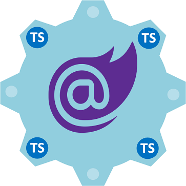

# ***[Trog.NET](https://trog.net)*** Articles

* Trog.NET is a series of .NET developer articles exploring Microsoft's .NET6 technologies.
* Subject matter objectives focus on application design, development patterns and solution architectures.
* Content covers a wide range of topics from enterprise/business applications to internet video game development.
* Articles are published on GitHub with releavant demos and source.

 ***Upcomming Articles***  
* Blazor CCCP (Cascading Controls Composite Pattern).
    An alternative to third party User Controls.
* Blazor WebRTC
    UDP data transmission.

#  
 ***Article 1***  

## &emsp;&emsp;[Blazor MVU](https://trog.net/Articles/BlazorMVU)

&emsp;&emsp;
This article overviews Single Page Applications 
[SPA](https://en.wikipedia.org/wiki/Single-page_application) and UI architectures featuring [MVU](https://thomasbandt.com/model-view-update).  
Then ventures to Microsoft's  [.NET Core](https://docs.microsoft.com/en-us/dotnet/core/introduction), [Blazor](https://docs.microsoft.com/en-us/aspnet/core/blazor/?view=aspnetcore-5.0)
and [MAUI](https://docs.microsoft.com/en-us/dotnet/maui/what-is-maui)

#  
 ***Article 2***  

## &emsp;&emsp;[Blazor Typescript Interop](https://trog.net/readme/BazorTSInterop)

&emsp;&emsp;
Blazor Typescript Interop is an elegant way to interface your Blazor C# WebAssembly (Wasm).  
With the browsers JavaScript API and JavaScript libraries.  
Interop is neccessary because Wasm can't reach outside the browser security sandbox.   
As there is no direct communication between Wasm and the browser JavaScript API.  
This article starts with JavaScript interop then progresses to TypeScript interop.   

#  
&copy; Copyright 2021 Warren Browne 